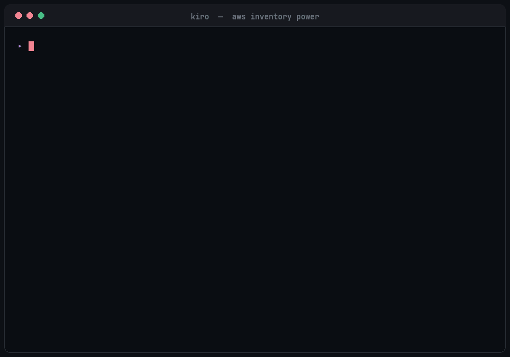

# AWS Inventory Power

A Kiro Power that scans your AWS account and generates comprehensive infrastructure inventory reports in Excel format — one sheet per service category, fully formatted with filters, color coding, and resource tagging.

Inspired by [aws-auto-inventory](https://github.com/aws-samples/aws-auto-inventory), rebuilt as a Kiro-native agent power with no external tool dependencies.

<p align="center">
  
</p>

---

## Features

- **109 service categories** across 13 groups — covers virtually every AWS service
- **3 scan modes** — Full (all services), Category (targeted groups), Quick (core infra only)
- **Region flexibility** — Single-region, multi-region, or all-region scanning
- **Excel output** — Professional workbook with formatted headers, auto-filters, freeze panes, and alternating row colors
- **Resource tagging** — Optionally includes tags for every resource (batch-fetched for efficiency)
- **Cost management** — Optional sheets for cost summary, budgets, savings plans, reserved instances, and anomaly detection
- **Configurable scope** — Pick exactly which services, groups, and regions to scan
- **Read-only** — Never creates, modifies, or deletes any AWS resource
- **Error resilient** — Handles access-denied, throttling, and missing services gracefully

---

## Quick Start

1. **Install the power** in Kiro
2. **Ensure AWS credentials** are configured (SSO, env vars, or credentials file)
3. **Say**: "Run an inventory of my AWS account" or "Full scan of us-east-1"
4. The agent will:
   - Validate your AWS session
   - Load scope or ask which regions/services to scan
   - Discover all resources across selected categories
   - Generate an Excel workbook at `./inventory-reports/aws-inventory-<accountId>-<date>.xlsx`

---

## Prerequisites

- **AWS credentials** available through the standard credential chain
- **IAM permissions**: Read-only access to the services you want to inventory. A policy like `ReadOnlyAccess` or `ViewOnlyAccess` works well.
- **Python 3.8+** with `openpyxl` installed (for Excel generation):
  ```bash
  pip install openpyxl
  ```

---

## Scan Modes

| Mode | Services Scanned | Estimated Time | Use Case |
|------|-----------------|----------------|----------|
| `full` | All 109 categories | 5–20 min | Complete audit, compliance review |
| `category` | User-selected groups or services | 2–10 min | Targeted investigation |
| `quick` | 12 core categories (EC2, Lambda, S3, VPC, etc.) | 1–3 min | Fast infrastructure overview |

### Examples

```
"Full scan of my account"           → full mode, all regions
"Quick scan of us-east-1"           → quick mode, single region
"Scan all Database services"        → category mode, Database group
"Scan EC2 and Lambda in us-west-2"  → category mode, specific services, single region
```

---

## Region Scope

| Mode | Description | Performance |
|------|-------------|-------------|
| `single` | One region only | Fastest (1–3 min) |
| `multi` | Specific list of regions | Moderate (3–8 min) |
| `all` | Every enabled region in the account | Slowest (10–20 min) |

Global services (IAM, S3, Route53, CloudFront, Organizations, Shield, etc.) are always scanned once regardless of region scope.

---

## Configuration

Copy `context-templates/inventory-scope.json` to your workspace root and customize:

```json
{
  "regions": ["us-east-1", "eu-west-1"],
  "regionScope": "multi",
  "scanMode": "full",
  "outputDir": "./inventory-reports",
  "includeTags": true,
  "includeCostSummary": false,
  "categories": ["EC2-Instances", "S3", "Lambda", "RDS"]
}
```

### Scan Mode Options
- `full` — Scans all 109 service categories
- `category` — Scans only the services listed in `categories` array
- `quick` — Scans only core compute, storage, and networking

### Region Scope Options
- `single` — Uses only the first region in the `regions` array
- `multi` — Scans all regions listed in the `regions` array
- `all` — Discovers and scans every enabled region (ignores `regions` array)

See `context-templates/README.md` for all available options and examples.

---

## Output

The generated Excel workbook includes:

| Sheet | Content |
|-------|---------|
| **Summary** | Account info, scan mode, region scope, resource counts by group and category |
| **EC2-Instances** | All EC2 instances with type, state, IPs, VPC, tags |
| **S3** | All buckets with region, versioning, encryption |
| **Lambda** | Functions with runtime, memory, timeout, tags |
| **...** | One sheet per scanned service category (up to 109) |
| **ScanNotes** | Errors, access-denied, throttled calls, skipped services |

---

## Service Categories (109)

### Identity & Access (Global) — 3 categories
| # | Category | Sheet Name |
|---|----------|-----------|
| 1 | IAM Users, Roles, Policies & Groups | IAM |
| 2 | IAM Identity Center (SSO) | IAM-IdentityCenter |
| 3 | AWS Organizations | Organizations |

### Compute (Per Region) — 14 categories
| # | Category | Sheet Name |
|---|----------|-----------|
| 4 | EC2 Instances | EC2-Instances |
| 5 | EC2 Security Groups | EC2-SecurityGroups |
| 6 | EC2 AMIs (owned) | EC2-AMIs |
| 7 | EC2 Key Pairs | EC2-KeyPairs |
| 8 | EC2 Placement Groups | EC2-PlacementGroups |
| 9 | EC2 Launch Templates | EC2-LaunchTemplates |
| 10 | Lambda Functions | Lambda |
| 11 | ECS Clusters & Services | ECS |
| 12 | EKS Clusters | EKS |
| 13 | Fargate Profiles | Fargate |
| 14 | Lightsail Instances | Lightsail |
| 15 | AWS Batch | Batch |
| 16 | App Runner Services | AppRunner |
| 17 | Elastic Beanstalk | ElasticBeanstalk |

### Storage (Global/Per Region) — 7 categories
| # | Category | Sheet Name |
|---|----------|-----------|
| 18 | S3 Buckets | S3 |
| 19 | EBS Volumes | EBS |
| 20 | EFS File Systems | EFS |
| 21 | FSx File Systems | FSx |
| 22 | S3 Glacier Vaults | S3-Glacier |
| 23 | Storage Gateway | StorageGateway |
| 24 | AWS Backup Vaults & Plans | Backup |

### Database (Per Region) — 11 categories
| # | Category | Sheet Name |
|---|----------|-----------|
| 25 | RDS Instances & Clusters | RDS |
| 26 | DynamoDB Tables | DynamoDB |
| 27 | ElastiCache Clusters | ElastiCache |
| 28 | Redshift Clusters | Redshift |
| 29 | OpenSearch Domains | OpenSearch |
| 30 | Neptune Clusters | Neptune |
| 31 | DocumentDB Clusters | DocumentDB |
| 32 | Amazon Keyspaces | Keyspaces |
| 33 | MemoryDB Clusters | MemoryDB |
| 34 | QLDB Ledgers | QLDB |
| 35 | Timestream Databases | Timestream |

### Networking (Per Region/Global) — 14 categories
| # | Category | Sheet Name |
|---|----------|-----------|
| 36 | VPC & Subnets & NAT/IGW | VPC |
| 37 | VPC Endpoints | VPC-Endpoints |
| 38 | VPC Peering Connections | VPC-PeeringConnections |
| 39 | Load Balancers (ALB/NLB/CLB/GWLB) | LoadBalancers |
| 40 | CloudFront Distributions | CloudFront |
| 41 | Route 53 Hosted Zones | Route53 |
| 42 | API Gateway (REST/HTTP/WebSocket) | APIGateway |
| 43 | Global Accelerator | GlobalAccelerator |
| 44 | Transit Gateways | TransitGateway |
| 45 | Direct Connect | DirectConnect |
| 46 | VPN Connections | VPN |
| 47 | PrivateLink Endpoints | PrivateLink |
| 48 | Network Firewall | NetworkFirewall |
| 49 | Elastic IPs | ElasticIP |

### Security (Per Region/Global) — 11 categories
| # | Category | Sheet Name |
|---|----------|-----------|
| 50 | KMS Keys | KMS |
| 51 | Secrets Manager | SecretsManager |
| 52 | WAF Web ACLs | WAF |
| 53 | Shield Protections | Shield |
| 54 | GuardDuty Detectors | GuardDuty |
| 55 | Security Hub | SecurityHub |
| 56 | Inspector | Inspector |
| 57 | Macie | Macie |
| 58 | ACM Certificates | ACM |
| 59 | Firewall Manager Policies | Firewall-Manager |
| 60 | IAM Access Analyzer | IAM-AccessAnalyzer |

### Application Integration (Per Region) — 7 categories
| # | Category | Sheet Name |
|---|----------|-----------|
| 61 | SQS Queues | SQS |
| 62 | SNS Topics | SNS |
| 63 | EventBridge Rules & Buses | EventBridge |
| 64 | Step Functions | StepFunctions |
| 65 | AppSync APIs | AppSync |
| 66 | Amazon MQ Brokers | MQ |
| 67 | SES Identities | SES |

### Analytics (Per Region) — 9 categories
| # | Category | Sheet Name |
|---|----------|-----------|
| 68 | Kinesis Streams | Kinesis |
| 69 | MSK Clusters | MSK |
| 70 | Glue Jobs, Crawlers & Databases | Glue |
| 71 | Athena Workgroups | Athena |
| 72 | EMR Clusters | EMR |
| 73 | QuickSight Datasets | QuickSight |
| 74 | Data Pipeline | DataPipeline |
| 75 | Lake Formation Resources | LakeFormation |
| 76 | OpenSearch Serverless Collections | OpenSearchServerless |

### Machine Learning (Per Region) — 8 categories
| # | Category | Sheet Name |
|---|----------|-----------|
| 77 | SageMaker Endpoints & Notebooks | SageMaker |
| 78 | Bedrock Models & Agents | Bedrock |
| 79 | Comprehend Endpoints | Comprehend |
| 80 | Rekognition Collections | Rekognition |
| 81 | Textract Adapters | Textract |
| 82 | Transcribe Jobs | Transcribe |
| 83 | Polly Lexicons | Polly |
| 84 | Forecast Datasets | Forecast |

### Management & Monitoring (Per Region/Global) — 8 categories
| # | Category | Sheet Name |
|---|----------|-----------|
| 85 | CloudWatch Alarms | CloudWatch |
| 86 | CloudFormation Stacks | CloudFormation |
| 87 | CloudTrail Trails | CloudTrail |
| 88 | AWS Config Rules | Config |
| 89 | Systems Manager | SystemsManager |
| 90 | Trusted Advisor Checks | TrustedAdvisor |
| 91 | Health Dashboard Events | HealthDashboard |
| 92 | Service Catalog | ServiceCatalog |

### Developer Tools (Per Region) — 7 categories
| # | Category | Sheet Name |
|---|----------|-----------|
| 93 | CodeCommit Repositories | CodeCommit |
| 94 | CodeBuild Projects | CodeBuild |
| 95 | CodeDeploy Applications | CodeDeploy |
| 96 | CodePipeline Pipelines | CodePipeline |
| 97 | CodeArtifact Repositories | CodeArtifact |
| 98 | Cloud9 Environments | Cloud9 |
| 99 | ECR Repositories | ECR |

### Migration & Transfer (Per Region) — 5 categories
| # | Category | Sheet Name |
|---|----------|-----------|
| 100 | DMS Replication Instances | DMS |
| 101 | Transfer Family Servers | TransferFamily |
| 102 | DataSync Tasks | DataSync |
| 103 | Migration Hub | MigrationHub |
| 104 | Snow Family Devices | Snow |

### Cost Management (Global) — 5 categories
| # | Category | Sheet Name |
|---|----------|-----------|
| 105 | Cost Summary (last 30 days) | CostSummary |
| 106 | Budgets | Budgets |
| 107 | Cost Anomaly Detection | CostAnomalyDetection |
| 108 | Savings Plans | SavingsPlans |
| 109 | Reserved Instances | ReservedInstances |

---

## Project Structure

```
power-aws-inventory/
├── context-templates/
│   ├── inventory-scope.json    # Configurable scan scope (mode, regions, categories)
│   └── README.md               # Scope configuration docs
├── inventory-reports/          # Output directory (gitignored)
├── scripts/
│   └── generate_excel.py      # Excel workbook generator
├── skills/
│   └── inventory/
│       └── SKILL.md           # Main inventory skill definition
├── steering/
│   ├── inventory-workflow.md  # API calls for all 109 service categories
│   └── excel-output.md       # Excel formatting rules
├── mcp.json                   # MCP server configuration
├── plugin.json                # Power metadata
├── README.md                  # This file
├── LICENSE                    # MIT License
└── .gitignore
```

---

## MCP Servers Used

| Server | Purpose |
|--------|---------|
| `aws-mcp` | Execute AWS API calls (list/describe operations) |
| `aws-documentation-mcp-server` | Attach relevant AWS docs links |

---

## How It Works

1. **Session validation** — Confirms AWS credentials via `sts:GetCallerIdentity`
2. **Scope configuration** — Loads scan mode (full/category/quick) and region scope (single/multi/all)
3. **Resource discovery** — Calls list/describe APIs per service via `aws-mcp` across target regions
4. **Tag enrichment** — Batch-fetches tags via Resource Groups Tagging API
5. **Data aggregation** — Collects all results into structured JSON
6. **Excel generation** — Runs `generate_excel.py` to produce the formatted workbook
7. **Summary presentation** — Shows resource counts, scan mode, regions, and file path

---

## Security

- **Read-only at the transport layer**: The `aws-mcp` proxy is configured with `--read-only`, so write-capable AWS tools are hidden and never exposed to the agent. This power never creates, modifies, or deletes any AWS resource.
- **Pinned dependencies**: All MCP server packages are pinned to exact versions in `mcp.json` (`mcp-proxy-for-aws==1.6.0`, `awslabs.aws-documentation-mcp-server==1.2.0`) so behavior does not change automatically on upstream releases.
- **Sensitive metadata handling**: The scan reads AWS account metadata that can be sensitive. The power applies these rules:
  - **IAM policies** — captures policy names, ARNs, and attachment counts only; full policy JSON documents are not exported.
  - **Lambda / ECS / Batch environment variables** — records variable names (keys) only, never their values.
  - **Secrets Manager & SSM SecureString** — metadata only (name, ARN, rotation status); secret values are never retrieved.
  - **Tags** — values whose key contains `password`, `secret`, `key`, `token`, or `credential` are masked.
- **Resource identifiers**: ARNs, IPs, endpoints, and account IDs are included by design for inventory purposes. Because the generated workbook contains this identifying data, treat the output file as sensitive.
- **Local only**: All data stays on your machine in `inventory-reports/`. Nothing is uploaded anywhere.

---

## Privacy Policy

This power runs entirely on your local machine. No data is collected, transmitted, or stored externally. AWS API calls are made directly from your machine using your own credentials. See [Privacy Policy](https://github.com/aquavis12/power-aws-inventory/blob/main/PRIVACY.md) for details.

---

## Issues & Support

Found a bug or have a feature request?

- **GitHub Issues**: [github.com/aquavis12/power-aws-inventory/issues](https://github.com/aquavis12/power-aws-inventory/issues)
- **Email**: rachapudivishnu9@gmail.com

---

## License

MIT — see [LICENSE](LICENSE)
